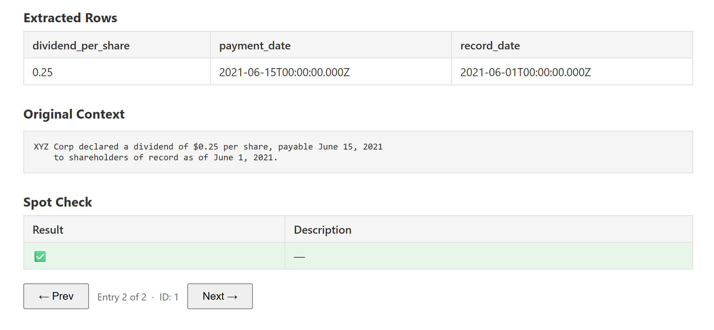

# txt2dataset
A package for building, standardizing and validating datasets using language models. Supports normal API as well as batch API.

* [Get a Gemini API Key](https://ai.google.dev/gemini-api/docs/api-key)

## Models Supported

* Gemini - Make sure to set your "GEMINI_API_KEY" to environment.
* OpenRouter - "OPENROUTER_API_KEY"
* OpenAI - "OPENAI_API_KEY"
* Custom OpenAI Endpoint - such as via Azure.

## Installation

```bash
pip install txt2dataset
```

## Usage

### Schema

```python
from pydantic import BaseModel
from typing import Optional, List
from datetime import datetime

class SingleDividend(BaseModel):
    dividend_per_share: float
    payment_date: Optional[datetime] = None
    record_date: Optional[datetime] = None
    stock_type_specified: Optional[str] = None

class DividendExtraction(BaseModel):
    info_found: bool
    data: List[SingleDividend] = []
```

### Entries
Entries consist of an identifier and the text to be structured.
```python
entries = [{'id':0, 'context':
    """First Business Financial Services, Inc. (the "Company") issued a press release today 
    announcing that the Company's Board of Directors declared a quarterly dividend of $0.18 
    per share on April 30, 2021, unchanged compared to the last quarterly dividend per share. 
    The dividend is payable on May 24, 2021 to shareholders of record on May 10, 2021. 
    Also on July 12, 2020 there was a payable dividend of $0.15 per share to shareholders 
    of record on July 1st, 2020."""},

    {"id":1,"context": """XYZ Corp declared a dividend of $0.25 per share, payable June 15, 2021 
    to shareholders of record as of June 1, 2021."""}
]
```

### Prompt
Choose a prompt such as:
```python
prompt = "Extract ALL dividend information from this text"
```

### Dataset Builder

Choose the requests per minute that work for your api key and model.

```python
from txt2dataset import GeminiAPIBuilder

builder = GeminiAPIBuilder()
results = builder.build(prompt=prompt, schema=DividendExtraction, model="gemini-2.5-flash-lite",
               entries=entries, rpm=4_000, tpm=4_000_000, rpm_threshold=0.75, tpm_threshold=0.75)
```

Result

| id | dividend_per_share | payment_date                  | record_date                   | stock_type_specified |
|-----|---------------------|-------------------------------|-------------------------------|-----------------------|
| 0   | 0.18                | 2021-05-24 00:00:00+00:00    | 2021-05-10 00:00:00+00:00    | quarterly             |
| 0   | 0.15                | 2020-07-12 00:00:00+00:00    | 2020-07-01 00:00:00+00:00    | quarterly             |
| 1   | 0.25                | 2021-06-15 00:00:00+00:00    | 2021-06-01 00:00:00+00:00    |                       |


### Spot Checking
Use `spotcheck()` to check if results look good. Highly recommended to use a more powerful model for spot checking, and cheap model for dataset generation.

```python

spotchecks = builder.spotcheck(prompt=prompt, schema=DividendExtraction, model="gemini-2.5-flash", entries=entries,
               results=results, sample_size = 10, rpm=4_000, tpm=4_000_000, rpm_threshold=0.75, tpm_threshold=0.75)
```

Result

| id | correct | desc |
|----|---------|------|
| 1  | true    |      |
| 0  | false   | The `stock_type_specified` for the $0.15 dividend is incorrectly listed as `'quarterly'`; the source text does not explicitly state it for this particular dividend, so it should be `null`. |

### Spot Checking Visualization

Use `spotcheck_visualize()` for an interactive visual method. 

Hotkeys: `LEFT/RIGHT` (or `A/D`) to navigate, `F` to copy extracted rows (JSON) to clipboard, `R` to reject and append to `reject.json`,  `P` to copy the current ID, `O` to reject and append to `reject_id.json` (configurable).

Customize hotkeys via `txt2dataset.config` (e.g. `from txt2dataset import config; config.SET_REJECT_KEY("X")`) before calling `spotcheck_visualize()`. Settings persist in `~/.txt2dataset/config.json` (override with `TXT2DATASET_CONFIG_PATH`).

`SET_*` accepts a string or a list (to bind multiple keys). For BACK/FORWARD, include `"ArrowLeft"` / `"ArrowRight"` in the list if you want to keep arrow navigation.

Example:

```python
from txt2dataset import config

config.SET_BACK_KEY(["ArrowLeft", "J"])
config.SET_FORWARD_KEY(["ArrowRight", "K"])
config.SET_COPY_EXTRACTED_ROWS_KEY(["F", "C"])
config.SET_COPY_ID_KEY(["P"])
config.SET_DOWNLOAD_EXTRACTED_ROWS_KEY(["O"])
config.SET_REJECT_KEY(["R", "X"])
config.SET_REJECT_FILE("my_rejects.json")
```

```python

builder.spotcheck_visualize(prompt=prompt, schema=DividendExtraction, model="gemini-2.5-flash", entries=entries,
               results=results, sample_size = 10, rpm=4_000, tpm=4_000_000, rpm_threshold=0.75, tpm_threshold=0.75)
```


### Examples

See [examples](examples/).
